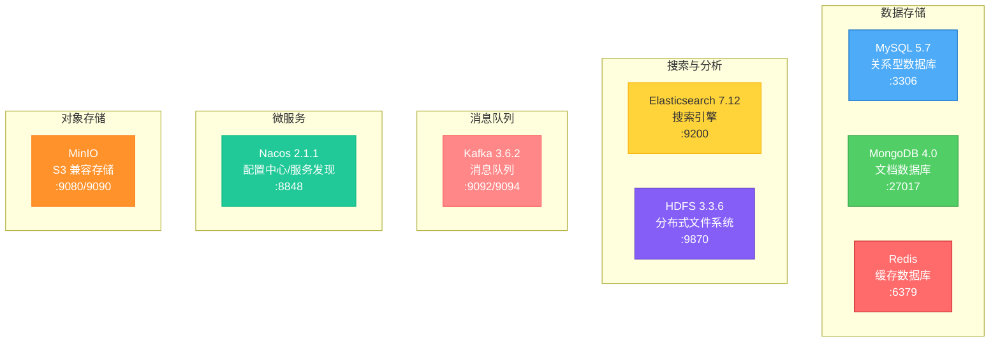
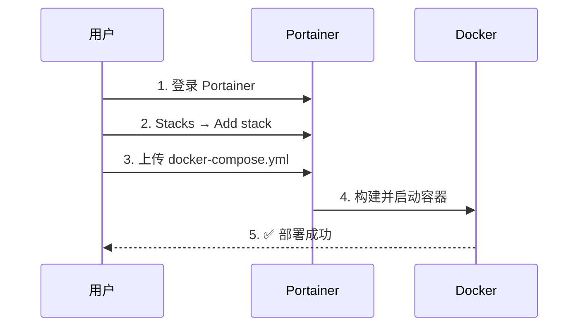

# Portainer 中间件部署项目

一站式 Docker Compose 中间件部署方案，适用于 Portainer 和命令行部署。

## 项目特点

✅ **统一结构**：所有中间件遵循相同的目录结构  
✅ **开箱即用**：预配置常用参数，快速部署  
✅ **数据持久化**：所有数据自动持久化到本地  
✅ **详细文档**：每个中间件都有完整的使用文档  
✅ **Portainer 友好**：专为 Portainer 优化  

## 架构图



## 快速导航

| 中间件 | 端口 | Web UI | 文档 |
|--------|------|--------|------|
| [Elasticsearch](./elasticsearch/) | 9200 | ❌ | [查看](./elasticsearch/README.md) |
| [MySQL](./mysql/) | 3306 | ❌ | [查看](./mysql/README.md) |
| [Nacos](./nacos/) | 8848 | ✅ http://localhost:8848/nacos | [查看](./nacos/README.md) |
| [Redis](./redis/) | 6379 | ❌ | [查看](./redis/README.md) |
| [MongoDB](./mongodb/) | 27017 | ❌ | [查看](./mongodb/README.md) |
| [MinIO](./minio/) | 9080/9090 | ✅ http://localhost:9090 | [查看](./minio/README.md) |
| [Kafka](./kafka/) | 9092/9094 | ❌ | [查看](./kafka/README.md) |
| [HDFS](./hdfs/) | 9870 | ✅ http://localhost:9870 | [查看](./hdfs/README.md) |
| [FastDFS](./fastdfs/) | 22122, 8888 | ✅ http://localhost:8888 | [查看](./fastdfs/README.md) |

## 快速开始

### 在 Portainer 中部署



**步骤**：
1. 登录 Portainer
2. 进入 **Stacks** → **Add stack**
3. 选择中间件目录，上传 `docker-compose.yml`
4. 点击 **Deploy the stack**

### 命令行部署

```bash
# 克隆项目
git clone <your-repo>
cd portainer-deploy

# 部署单个中间件
cd mysql
docker-compose up -d

# 查看日志
docker-compose logs -f

# 停止服务
docker-compose down
```

## 目录结构

```
portainer-deploy/
│
├── README.md                 # 项目总览（本文件）
├── 中间件.md                  # 中间件列表和说明
│
├── elasticsearch/            # Elasticsearch 搜索引擎
│   ├── docker-compose.yml
│   ├── README.md
│   ├── data/                # 数据目录
│   └── logs/                # 日志目录
│
├── mysql/                   # MySQL 数据库
│   ├── docker-compose.yml
│   ├── README.md
│   ├── config/
│   │   └── my.cnf          # MySQL 配置
│   ├── init/
│   │   └── init.sql        # 初始化脚本
│   └── data/               # 数据目录
│
├── nacos/                   # Nacos 配置中心
│   ├── docker-compose.yml
│   ├── README.md
│   ├── data/
│   └── logs/
│
├── redis/                   # Redis 缓存
│   ├── docker-compose.yml
│   ├── README.md
│   ├── config/
│   │   └── redis.conf      # Redis 配置
│   └── data/
│
├── mongodb/                 # MongoDB 文档数据库
│   ├── docker-compose.yml
│   ├── README.md
│   ├── init/
│   │   └── init.js         # 初始化脚本
│   ├── data/
│   └── config/
│
├── minio/                   # MinIO 对象存储
│   ├── docker-compose.yml
│   ├── README.md
│   └── data/
│
├── kafka/                   # Kafka 消息队列
│   ├── docker-compose.yml
│   ├── README.md
│   └── data/
│
└── hdfs/                    # Hadoop HDFS
    ├── docker-compose.yml
    ├── Dockerfile
    ├── README.md
    ├── config/
    │   ├── core-site.xml
    │   └── hdfs-site.xml
    └── data/
```

## 端口规划

| 中间件 | 端口 | 协议 | 说明 |
|--------|------|------|------|
| Elasticsearch | 9200 | HTTP | REST API |
| Elasticsearch | 9300 | TCP | 节点通信 |
| MySQL | 3306 | TCP | 数据库连接 |
| Nacos | 8848 | HTTP | Web UI / API |
| Nacos | 9848, 9849 | gRPC | 客户端通信 |
| Redis | 6379 | TCP | 数据库连接 |
| MongoDB | 27017 | TCP | 数据库连接 |
| MinIO | 9080 | HTTP | S3 API |
| MinIO | 9090 | HTTP | Web 控制台 |
| Kafka | 9092 | TCP | 内部通信 |
| Kafka | 9094 | TCP | 外部访问 |
| HDFS | 9870 | HTTP | NameNode Web UI |
| HDFS | 9000 | RPC | HDFS 客户端 |

## 使用场景

### 微服务架构

```
Nacos (配置中心) + Kafka (消息队列) + Redis (缓存)
```

### 大数据平台

```
HDFS (存储) + Elasticsearch (搜索) + Kafka (数据流)
```

### 全栈应用

```
MySQL (业务数据) + Redis (缓存) + MinIO (文件存储)
```

## 常见问题

### 端口冲突

修改 `docker-compose.yml` 中的端口映射：

```yaml
ports:
  - "新端口:容器端口"  # 修改左边的端口
```

### 数据持久化

所有数据都保存在各中间件的 `data/` 目录下，可以直接备份：

```bash
tar -czf backup.tar.gz */data/
```

### 内存不足

调整容器内存限制或减少同时运行的服务数量。

### 权限问题

```bash
# Linux/Mac
chmod -R 777 */data/ */config/
```

## 性能优化建议

1. **SSD 存储**：数据目录使用 SSD
2. **资源限制**：合理设置 CPU 和内存限制
3. **网络优化**：使用 Docker 网络连接容器
4. **日志管理**：配置日志轮转，避免日志文件过大

## 安全建议

⚠️ **重要**：默认配置仅适用于开发环境！

生产环境必须：
1. ✅ 修改所有默认密码
2. ✅ 启用认证和授权
3. ✅ 配置防火墙规则
4. ✅ 使用 HTTPS/TLS
5. ✅ 定期备份数据
6. ✅ 更新到最新稳定版本

## 监控与管理

推荐工具：
- **Portainer**：容器管理
- **Grafana + Prometheus**：监控
- **ELK Stack**：日志分析

## 贡献

欢迎提交 Issue 和 Pull Request！

## 许可证

本项目仅用于学习和开发环境。生产环境使用请遵循各中间件的许可证要求。

---

**快速链接**：
- [中间件列表](./中间件.md)
- [Elasticsearch 文档](./elasticsearch/README.md)
- [MySQL 文档](./mysql/README.md)
- [Nacos 文档](./nacos/README.md)
- [Redis 文档](./redis/README.md)
- [MongoDB 文档](./mongodb/README.md)
- [MinIO 文档](./minio/README.md)
- [Kafka 文档](./kafka/README.md)
- [HDFS 文档](./hdfs/README.md)
