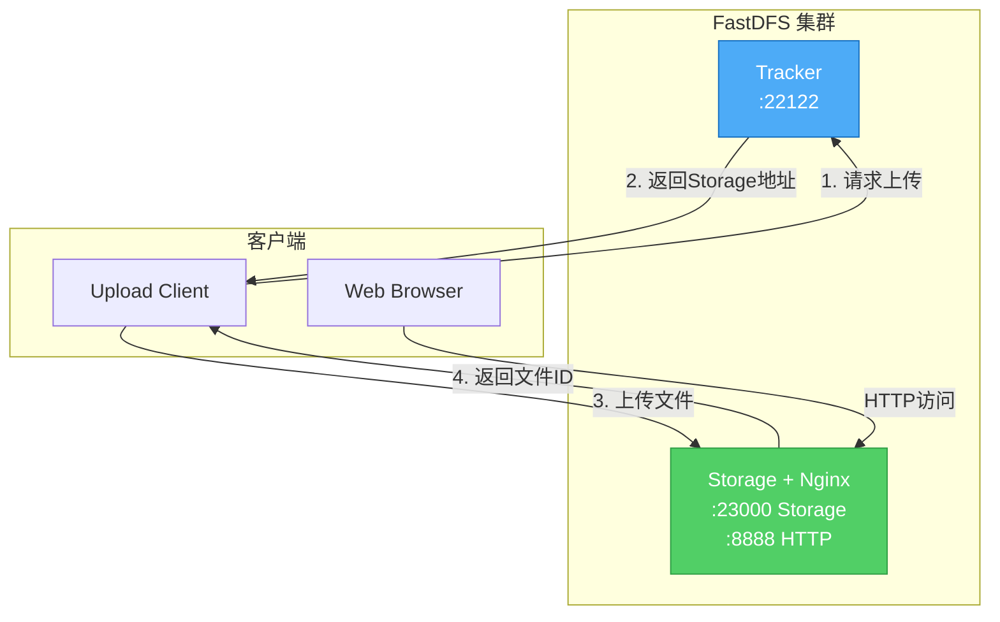

# FastDFS 部署文档

## 端口说明

| 端口 | 用途 |
|------|------|
| 22122 | Tracker 服务端口 |
| 23000 | Storage 服务端口 |
| 8888 | Nginx HTTP 访问端口 |

## 默认配置

- **基础镜像**：delron/fastdfs
- **时区**：Asia/Shanghai
- **网络模式**：host（使用宿主机网络）
- **存储组**：group1

## 架构图



**说明**：
- Tracker 容器：负责调度和负载均衡
- Storage 容器：同时运行 Storage 服务和 Nginx，提供文件存储和 HTTP 访问

## 部署步骤

### 方式 1：在 Portainer 中部署（推荐）

**不需要创建 .env 文件！** Portainer 提供了更方便的环境变量配置方式。

1. **进入 Portainer**
   - Stacks → Add stack
   - 上传 `docker-compose.yml`

2. **配置环境变量**
   - 在 Stack 编辑器下方找到 "Environment variables" 区域
   - 点击 "Add an environment variable"
   - 添加环境变量：
     - **Name**: `TRACKER_SERVER`
     - **Value**: `192.168.1.100:22122`（替换为你的服务器 IP）

3. **部署 Stack**
   - 点击 "Deploy the stack"
   - 等待部署完成

4. **验证部署**
   - 检查容器状态：所有容器应为 "running"
   - 访问 http://你的IP:8888

**Portainer 环境变量配置示例**：

```
┌─────────────────────────────────────────┐
│ Environment variables                    │
├─────────────────────────────────────────┤
│ Name: TRACKER_SERVER                     │
│ Value: 192.168.1.100:22122              │
│ [+ Add an environment variable]         │
└─────────────────────────────────────────┘
```

### 方式 2：命令行部署

```bash
cd fastdfs

# 方式 2.1：使用 .env 文件
cp .env.example .env
# 编辑 .env 文件，设置 TRACKER_SERVER
vim .env

# 启动服务
docker-compose up -d

# 方式 2.2：直接设置环境变量
export TRACKER_SERVER=192.168.1.100:22122
docker-compose up -d

# 方式 2.3：命令行传递环境变量
TRACKER_SERVER=192.168.1.100:22122 docker-compose up -d

# 查看日志
docker-compose logs -f

# 查看容器状态
docker-compose ps
```

## 目录说明

```
fastdfs/
├── docker-compose.yml    # Docker Compose 配置
├── Dockerfile           # 自定义镜像构建文件
├── README.md            # 本文档
├── DEPLOY.md            # 快速部署指南
├── .env.example         # 环境变量配置示例
├── config/              # 配置文件目录
│   ├── nginx.conf      # Nginx 配置（构建时复制到镜像）
│   └── start-storage.sh # Storage + Nginx 启动脚本
└── data/                # 数据目录（自动创建）
    ├── tracker/         # Tracker 数据
    └── storage/         # Storage 数据
        ├── data/        # 文件存储
        └── logs/        # 日志文件
```

**注意**：
- Storage 容器同时运行 Storage 服务和 Nginx
- Nginx 配置文件和启动脚本在构建时复制到镜像中
- 如需修改配置，需要重新构建镜像

## 访问方式

### HTTP 访问

```
http://你的服务器IP:8888/group1/M00/00/00/文件名
```

### 测试上传

```bash
# 进入 storage 容器
docker exec -it fastdfs-storage bash

# 创建测试文件
echo "Hello FastDFS - $(date)" > /tmp/test.txt

# 上传文件
/usr/bin/fdfs_upload_file /etc/fdfs/client.conf /tmp/test.txt

# 返回结果示例：group1/M00/00/00/wKgBcGXxxx.txt
# 访问地址：http://你的IP:8888/group1/M00/00/00/wKgBcGXxxx.txt
```

## 基本操作

### 文件上传

```bash
# 进入 storage 容器
docker exec -it fastdfs-storage bash

# 上传文件
/usr/bin/fdfs_upload_file /etc/fdfs/client.conf /path/to/file

# 示例：上传测试文件
echo "Hello FastDFS" > /tmp/test.txt
/usr/bin/fdfs_upload_file /etc/fdfs/client.conf /tmp/test.txt

# 返回结果示例：
# group1/M00/00/00/wKgBcGXxxx.txt
```

### 文件下载

```bash
# 方式 1：通过 HTTP 下载
curl http://localhost:8888/group1/M00/00/00/wKgBcGXxxx.txt

# 方式 2：使用 fdfs_download_file
docker exec fastdfs-storage /usr/bin/fdfs_download_file /etc/fdfs/client.conf group1/M00/00/00/wKgBcGXxxx.txt
```

### 文件删除

```bash
# 删除文件
docker exec fastdfs-storage /usr/bin/fdfs_delete_file /etc/fdfs/client.conf group1/M00/00/00/wKgBcGXxxx.txt
```

### 查看文件信息

```bash
# 查看文件元数据
docker exec fastdfs-storage /usr/bin/fdfs_file_info /etc/fdfs/client.conf group1/M00/00/00/wKgBcGXxxx.txt
```

## 客户端集成

### Java 客户端

**依赖**：

```xml
<dependency>
    <groupId>com.github.tobato</groupId>
    <artifactId>fastdfs-client</artifactId>
    <version>1.27.2</version>
</dependency>
```

**配置**：

```yaml
fdfs:
  so-timeout: 1500
  connect-timeout: 600
  thumb-image:
    width: 150
    height: 150
  tracker-list:
    - 192.168.1.100:22122
```

**示例代码**：

```java
import com.github.tobato.fastdfs.domain.fdfs.StorePath;
import com.github.tobato.fastdfs.service.FastFileStorageClient;
import org.springframework.beans.factory.annotation.Autowired;
import org.springframework.stereotype.Service;
import org.springframework.web.multipart.MultipartFile;

@Service
public class FastDFSService {
    
    @Autowired
    private FastFileStorageClient storageClient;
    
    // 上传文件
    public String uploadFile(MultipartFile file) throws Exception {
        String extension = file.getOriginalFilename()
            .substring(file.getOriginalFilename().lastIndexOf(".") + 1);
        
        StorePath storePath = storageClient.uploadFile(
            file.getInputStream(),
            file.getSize(),
            extension,
            null
        );
        
        return storePath.getFullPath();
    }
    
    // 删除文件
    public void deleteFile(String fileUrl) {
        storageClient.deleteFile(fileUrl);
    }
}
```

### Python 客户端

**安装**：

```bash
pip install py3fdfs
```

**示例代码**：

```python
from fdfs_client.client import Fdfs_client

# 配置
client = Fdfs_client({
    'host_tuple': ('192.168.1.100', 22122),
    'timeout': 30,
    'name': 'Tracker Pool'
})

# 上传文件
result = client.upload_by_filename('test.txt')
print(result)
# {'Status': 'Upload successed.', 'Remote file_id': 'group1/M00/00/00/xxx.txt'}

# 下载文件
result = client.download_to_file('local.txt', 'group1/M00/00/00/xxx.txt')

# 删除文件
result = client.delete_file('group1/M00/00/00/xxx.txt')
```

### Go 客户端

**安装**：

```bash
go get github.com/weilaihui/fdfs_client
```

**示例代码**：

```go
package main

import (
    "fmt"
    "github.com/weilaihui/fdfs_client"
)

func main() {
    // 创建客户端
    client, err := fdfs_client.NewFdfsClient("client.conf")
    if err != nil {
        panic(err)
    }
    
    // 上传文件
    fileId, err := client.UploadByFilename("test.txt")
    if err != nil {
        panic(err)
    }
    fmt.Println("File ID:", fileId)
    
    // 下载文件
    err = client.DownloadToFile("local.txt", fileId)
    if err != nil {
        panic(err)
    }
    
    // 删除文件
    err = client.DeleteFile(fileId)
    if err != nil {
        panic(err)
    }
}
```

## 配置说明

### 环境变量

| 变量名 | 说明 | 默认值 | 示例 |
|--------|------|--------|------|
| TRACKER_SERVER | Tracker 服务器地址 | 127.0.0.1:22122 | 192.168.1.100:22122 |
| TZ | 时区 | Asia/Shanghai | Asia/Shanghai |

**配置方式**：

1. **使用 .env 文件**（推荐）
   ```bash
   cp .env.example .env
   vim .env
   ```

2. **在 Portainer 中配置**
   - Stack 编辑器 → Environment variables
   - 添加 `TRACKER_SERVER=你的IP:22122`

3. **命令行传递**
   ```bash
   TRACKER_SERVER=192.168.1.100:22122 docker-compose up -d
   ```

### Tracker 配置

主要配置文件：`/etc/fdfs/tracker.conf`

```ini
# 端口
port=22122

# 数据和日志目录
base_path=/var/fdfs

# HTTP 端口
http.server_port=8080
```

### Storage 配置

主要配置文件：`/etc/fdfs/storage.conf`

```ini
# 组名
group_name=group1

# 端口
port=23000

# 数据和日志目录
base_path=/var/fdfs

# 存储路径
store_path0=/var/fdfs/storage/data

# Tracker 服务器
tracker_server=192.168.1.100:22122
```

### Nginx 配置

配置文件：`config/nginx.conf`（在构建时复制到镜像中）

```nginx
server {
    listen       8888;
    server_name  localhost;

    location / {
        root   /var/fdfs;
        ngx_fastdfs_module;
    }

    location ~ /group[0-9]/M00 {
        root /var/fdfs/storage/data;
        ngx_fastdfs_module;
    }
}
```

**修改 Nginx 配置**：

1. 编辑 `config/nginx.conf`
2. 重新构建镜像：
   ```bash
   docker-compose build --no-cache nginx
   docker-compose up -d nginx
   ```

**注意**：配置文件在构建时复制到镜像中，不支持热更新。

## 管理操作

### 查看集群状态

```bash
# 查看 Tracker 状态
docker exec fastdfs-tracker /usr/bin/fdfs_monitor /etc/fdfs/client.conf

# 查看 Storage 状态
docker exec fastdfs-storage /usr/bin/fdfs_monitor /etc/fdfs/storage.conf
```

### 查看日志

```bash
# Tracker 日志
docker logs fastdfs-tracker

# Storage 日志
docker logs fastdfs-storage

# Nginx 日志
docker logs fastdfs-nginx

# 查看详细日志
docker exec fastdfs-storage tail -f /var/fdfs/logs/storaged.log
```

### 重启服务

```bash
# 重启所有服务
docker-compose restart

# 重启单个服务
docker-compose restart tracker
docker-compose restart storage
docker-compose restart nginx
```

### 停止服务

```bash
# 停止所有服务
docker-compose down

# 停止并删除数据
docker-compose down -v
```

## 监控

### 查看存储空间

```bash
# 查看磁盘使用情况
docker exec fastdfs-storage df -h /var/fdfs

# 查看文件数量
docker exec fastdfs-storage find /var/fdfs/storage/data -type f | wc -l
```

### 查看连接数

```bash
# 查看 Tracker 连接
docker exec fastdfs-tracker netstat -an | grep 22122

# 查看 Storage 连接
docker exec fastdfs-storage netstat -an | grep 23000
```

## 备份与恢复

### 备份

```bash
# 停止服务
docker-compose down

# 备份数据目录
tar -czf fastdfs-backup-$(date +%Y%m%d).tar.gz data/

# 启动服务
docker-compose up -d
```

### 恢复

```bash
# 停止服务
docker-compose down

# 恢复数据
tar -xzf fastdfs-backup-20240101.tar.gz

# 启动服务
docker-compose up -d
```

## 性能优化

### 调整连接数

编辑 Storage 配置：

```ini
# 最大连接数
max_connections=256

# 工作线程数
work_threads=4
```

### 调整缓冲区

```ini
# 上传缓冲区大小
buff_size=256KB

# 磁盘读写缓冲区
disk_rw_separated=true
disk_reader_threads=1
disk_writer_threads=1
```

### 启用文件去重

```ini
# 启用文件去重
check_file_duplicate=1
```

## 常见问题

### Tracker 无法启动

**原因**：端口被占用或数据目录权限问题

**解决**：

```bash
# 检查端口
netstat -tuln | grep 22122

# 修改权限
chmod -R 777 data/tracker
```

### Storage 无法连接 Tracker

**原因**：TRACKER_SERVER 配置错误

**解决**：

编辑 `docker-compose.yml`，确保 `TRACKER_SERVER` 配置正确：

```yaml
environment:
  - TRACKER_SERVER=你的服务器IP:22122
```

### Nginx 无法访问文件

**原因**：Nginx 配置错误或文件路径不正确

**解决**：

```bash
# 检查 Nginx 配置
docker exec fastdfs-nginx nginx -t

# 重新加载配置
docker exec fastdfs-nginx nginx -s reload

# 检查文件是否存在
docker exec fastdfs-storage ls -la /var/fdfs/storage/data/00/00/
```

### 文件上传失败

**原因**：Storage 磁盘空间不足或权限问题

**解决**：

```bash
# 检查磁盘空间
df -h

# 检查目录权限
chmod -R 777 data/storage

# 查看 Storage 日志
docker logs fastdfs-storage
```

### 端口被占用

**解决**：修改 `docker-compose.yml` 中的端口映射（如果不使用 host 网络模式）

## 集群扩展

### 添加 Storage 节点

编辑 `docker-compose.yml`，添加新的 Storage 服务：

```yaml
storage2:
  build: .
  container_name: fastdfs-storage2
  hostname: storage2
  network_mode: host
  environment:
    - TZ=Asia/Shanghai
    - TRACKER_SERVER=192.168.1.100:22122
  volumes:
    - ./data/storage2:/var/fdfs
    - /etc/localtime:/etc/localtime:ro
  command: storage
  depends_on:
    - tracker
  restart: unless-stopped
```

### 添加 Tracker 节点（高可用）

部署多个 Tracker 节点，客户端配置多个 Tracker 地址：

```yaml
tracker_list:
  - 192.168.1.100:22122
  - 192.168.1.101:22122
```

## 安全建议

⚠️ **当前配置仅适用于开发环境！**

生产环境必须：

1. ✅ 配置防火墙规则，限制访问来源
2. ✅ 启用 Token 防盗链
3. ✅ 配置 HTTPS（Nginx SSL）
4. ✅ 定期备份数据
5. ✅ 监控磁盘空间和性能
6. ✅ 设置文件访问权限

### 启用 Token 防盗链

编辑 Storage 配置：

```ini
# 启用 Token
http.anti_steal.check_token=true

# Token 密钥
http.anti_steal.secret_key=FastDFS1234567890

# Token 过期时间（秒）
http.anti_steal.token_ttl=1800
```

## 防火墙配置

### CentOS/RHEL

```bash
firewall-cmd --zone=public --permanent --add-port=22122/tcp
firewall-cmd --zone=public --permanent --add-port=23000/tcp
firewall-cmd --zone=public --permanent --add-port=8888/tcp
firewall-cmd --reload
```

### Ubuntu/Debian

```bash
sudo ufw allow 22122/tcp
sudo ufw allow 23000/tcp
sudo ufw allow 8888/tcp
sudo ufw reload
```

## 参考资料

- [FastDFS 官方文档](https://github.com/happyfish100/fastdfs)
- [FastDFS 配置详解](https://github.com/happyfish100/fastdfs/wiki)
- [Nginx FastDFS 模块](https://github.com/happyfish100/fastdfs-nginx-module)

## 故障排查

### 查看详细日志

```bash
# Tracker 日志
docker exec fastdfs-tracker tail -f /var/fdfs/logs/trackerd.log

# Storage 日志
docker exec fastdfs-storage tail -f /var/fdfs/logs/storaged.log

# Nginx 日志
docker exec fastdfs-nginx tail -f /usr/local/nginx/logs/error.log
```

### 测试网络连接

```bash
# 测试 Tracker 连接
telnet 192.168.1.100 22122

# 测试 Storage 连接
telnet 192.168.1.100 23000

# 测试 HTTP 访问
curl http://192.168.1.100:8888
```

## 许可证

本配置基于 delron/fastdfs 镜像，FastDFS 遵循 GPL v3 许可证。
