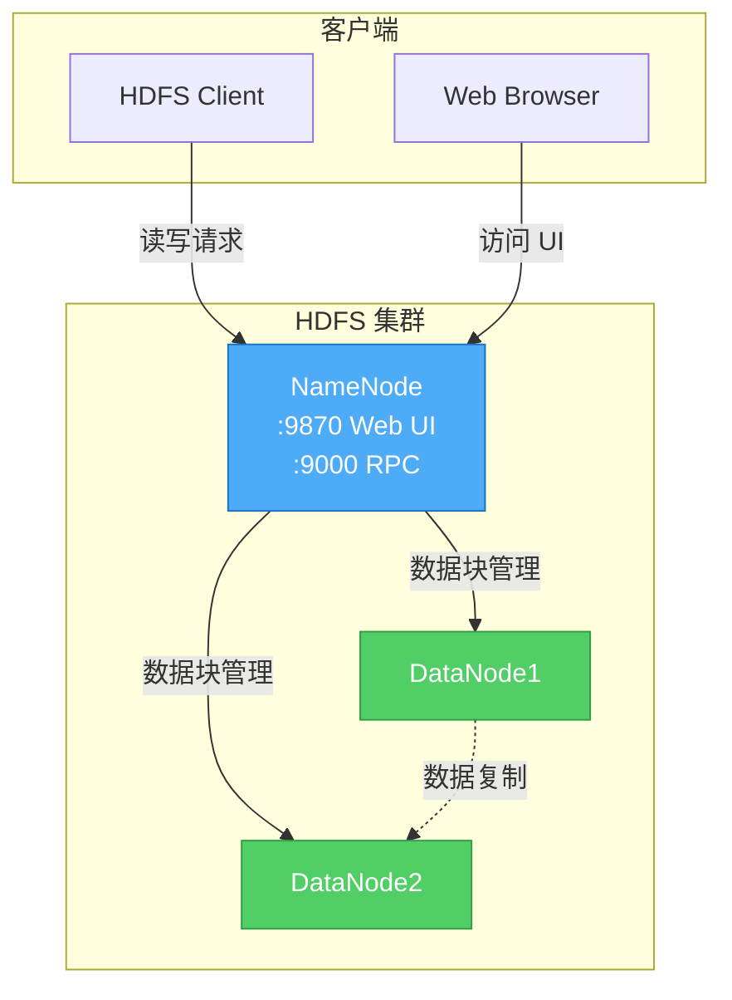

# Hadoop HDFS 部署文档

## 端口说明

| 端口 | 用途 |
|------|------|
| 9870 | NameNode Web UI（HTTP） |
| 9000 | NameNode RPC 端口（HDFS 客户端通信） |

## 默认配置

- **Hadoop 版本**：3.3.6
- **副本数**：2
- **节点配置**：1 个 NameNode + 2 个 DataNode
- **权限检查**：关闭（开发环境）

## 架构图



## 部署步骤

### 在 Portainer 中部署

1. **清理旧容器和镜像**（如果之前部署过）
   - 进入 Portainer → Containers
   - 删除所有 namenode、datanode 容器
   - 进入 Images → 删除所有 hdfs 相关镜像

2. **部署新 Stack**
   - 进入 Portainer → Stacks → Add stack
   - 上传 `docker-compose.yml`
   - 点击 "Deploy the stack"
   - 等待构建完成（首次构建需要 5-10 分钟）

3. **验证部署**
   - 访问 http://localhost:9870
   - 检查 "Datanodes" 标签，应该看到 2 个 Live DataNodes

### 命令行部署

```bash
cd hdfs

# 首次部署或重新构建
docker-compose build --no-cache
docker-compose up -d

# 查看日志
docker-compose logs -f

# 查看容器状态
docker-compose ps
```

## 目录说明

```
hdfs/
├── docker-compose.yml    # Docker Compose 配置
├── Dockerfile           # 自定义镜像构建文件
├── README.md            # 本文档
├── config/              # 配置文件目录
│   ├── core-site.xml   # Hadoop 核心配置
│   └── hdfs-site.xml   # HDFS 配置
└── data/                # 数据目录（自动创建）
    ├── namenode/        # NameNode 数据
    ├── datanode1/       # DataNode1 数据
    └── datanode2/       # DataNode2 数据
```

## 访问方式

### Web UI

```
http://localhost:9870
```

**功能**：
- 查看集群状态
- 浏览文件系统
- 查看 DataNode 列表
- 查看日志和指标

### HDFS 命令行

```bash
# 进入 NameNode 容器
docker exec -it namenode bash

# 查看 HDFS 文件系统
hdfs dfs -ls /

# 创建目录
hdfs dfs -mkdir /test

# 上传文件
hdfs dfs -put /etc/hosts /test/

# 下载文件
hdfs dfs -get /test/hosts ./

# 查看文件内容
hdfs dfs -cat /test/hosts

# 删除文件
hdfs dfs -rm /test/hosts

# 删除目录
hdfs dfs -rm -r /test
```

## 基本操作

### 文件操作

```bash
# 创建目录
hdfs dfs -mkdir -p /user/hadoop/data

# 上传文件
hdfs dfs -put local_file.txt /user/hadoop/data/

# 上传目录
hdfs dfs -put -r local_dir /user/hadoop/

# 下载文件
hdfs dfs -get /user/hadoop/data/file.txt ./

# 复制文件
hdfs dfs -cp /source/file.txt /dest/

# 移动文件
hdfs dfs -mv /source/file.txt /dest/

# 删除文件
hdfs dfs -rm /user/hadoop/data/file.txt

# 递归删除目录
hdfs dfs -rm -r /user/hadoop/data
```

### 查看信息

```bash
# 查看文件详情
hdfs dfs -ls -h /user/hadoop/

# 查看文件内容
hdfs dfs -cat /user/hadoop/file.txt

# 查看文件头部
hdfs dfs -head /user/hadoop/file.txt

# 查看文件尾部
hdfs dfs -tail /user/hadoop/file.txt

# 查看磁盘使用情况
hdfs dfs -du -h /user/hadoop/

# 查看文件系统使用情况
hdfs dfs -df -h

# 查看文件块信息
hdfs fsck /user/hadoop/file.txt -files -blocks -locations
```

### 权限管理

```bash
# 修改文件权限
hdfs dfs -chmod 755 /user/hadoop/file.txt

# 修改文件所有者
hdfs dfs -chown hadoop:hadoop /user/hadoop/file.txt

# 递归修改权限
hdfs dfs -chmod -R 755 /user/hadoop/
```

## 配置说明

### core-site.xml

```xml
<configuration>
    <!-- HDFS 默认访问地址 -->
    <property>
        <name>fs.defaultFS</name>
        <value>hdfs://namenode:9000</value>
    </property>
    
    <!-- Hadoop 临时目录 -->
    <property>
        <name>hadoop.tmp.dir</name>
        <value>/opt/hadoop/data/tmp</value>
    </property>
</configuration>
```

### hdfs-site.xml

```xml
<configuration>
    <!-- 副本数 -->
    <property>
        <name>dfs.replication</name>
        <value>2</value>
    </property>
    
    <!-- 关闭权限检查（开发环境） -->
    <property>
        <name>dfs.permissions.enabled</name>
        <value>false</value>
    </property>
    
    <!-- NameNode 数据存储路径 -->
    <property>
        <name>dfs.namenode.name.dir</name>
        <value>file:///opt/hadoop/data/namenode</value>
    </property>
    
    <!-- DataNode 数据存储路径 -->
    <property>
        <name>dfs.datanode.data.dir</name>
        <value>file:///opt/hadoop/data/datanode</value>
    </property>
</configuration>
```

## 客户端集成

### Java API

**依赖**：

```xml
<dependency>
    <groupId>org.apache.hadoop</groupId>
    <artifactId>hadoop-client</artifactId>
    <version>3.3.6</version>
</dependency>
```

**示例代码**：

```java
import org.apache.hadoop.conf.Configuration;
import org.apache.hadoop.fs.FileSystem;
import org.apache.hadoop.fs.Path;

public class HDFSExample {
    public static void main(String[] args) throws Exception {
        // 配置
        Configuration conf = new Configuration();
        conf.set("fs.defaultFS", "hdfs://localhost:9000");
        
        // 获取文件系统
        FileSystem fs = FileSystem.get(conf);
        
        // 创建目录
        fs.mkdirs(new Path("/test"));
        
        // 上传文件
        fs.copyFromLocalFile(new Path("local.txt"), new Path("/test/remote.txt"));
        
        // 下载文件
        fs.copyToLocalFile(new Path("/test/remote.txt"), new Path("downloaded.txt"));
        
        // 删除文件
        fs.delete(new Path("/test/remote.txt"), false);
        
        // 关闭文件系统
        fs.close();
    }
}
```

### Python API (hdfs3)

**安装**：

```bash
pip install hdfs3
```

**示例代码**：

```python
from hdfs3 import HDFileSystem

# 连接 HDFS
hdfs = HDFileSystem(host='localhost', port=9000)

# 列出文件
hdfs.ls('/')

# 创建目录
hdfs.mkdir('/test')

# 上传文件
hdfs.put('local.txt', '/test/remote.txt')

# 下载文件
hdfs.get('/test/remote.txt', 'downloaded.txt')

# 读取文件
with hdfs.open('/test/remote.txt', 'rb') as f:
    content = f.read()

# 删除文件
hdfs.rm('/test/remote.txt')
```

### Python API (pyarrow)

**安装**：

```bash
pip install pyarrow
```

**示例代码**：

```python
import pyarrow as pa
from pyarrow import fs

# 连接 HDFS
hdfs = fs.HadoopFileSystem(host='localhost', port=9000)

# 列出文件
file_info = hdfs.get_file_info(fs.FileSelector('/'))

# 读取文件
with hdfs.open_input_stream('/test/file.txt') as f:
    content = f.read()

# 写入文件
with hdfs.open_output_stream('/test/output.txt') as f:
    f.write(b'Hello HDFS')
```

## 管理操作

### NameNode 管理

```bash
# 格式化 NameNode（仅首次或重置时）
hdfs namenode -format

# 查看 NameNode 状态
hdfs dfsadmin -report

# 进入安全模式
hdfs dfsadmin -safemode enter

# 离开安全模式
hdfs dfsadmin -safemode leave

# 查看安全模式状态
hdfs dfsadmin -safemode get
```

### DataNode 管理

```bash
# 查看 DataNode 列表
hdfs dfsadmin -report

# 刷新 DataNode
hdfs dfsadmin -refreshNodes

# 查看 DataNode 详情
hdfs dfsadmin -printTopology
```

### 健康检查

```bash
# 检查文件系统
hdfs fsck /

# 检查特定路径
hdfs fsck /user/hadoop -files -blocks -locations

# 查看损坏的文件
hdfs fsck / | grep CORRUPT
```

## 监控

### Web UI 监控

访问 http://localhost:9870，可以查看：

- **Overview**：集群概览
- **Datanodes**：DataNode 状态
- **Datanode Volume Failures**：磁盘故障
- **Snapshot**：快照信息
- **Startup Progress**：启动进度
- **Utilities**：工具（浏览文件系统、日志等）

### 命令行监控

```bash
# 查看集群状态
hdfs dfsadmin -report

# 查看文件系统统计
hdfs dfs -df -h

# 查看目录大小
hdfs dfs -du -h /user/hadoop

# 查看文件块分布
hdfs fsck /user/hadoop -files -blocks -locations
```

## 备份与恢复

### 备份

```bash
# 方式 1：使用 distcp（推荐）
hdfs distcp /source /backup

# 方式 2：导出到本地
hdfs dfs -get /user/hadoop ./backup/

# 方式 3：备份数据目录
docker-compose down
tar -czf hdfs-backup.tar.gz data/
docker-compose up -d
```

### 恢复

```bash
# 方式 1：从备份恢复
hdfs distcp /backup /user/hadoop

# 方式 2：从本地导入
hdfs dfs -put ./backup/* /user/hadoop/

# 方式 3：恢复数据目录
docker-compose down
tar -xzf hdfs-backup.tar.gz
docker-compose up -d
```

## 性能优化

### 调整副本数

```bash
# 修改文件副本数
hdfs dfs -setrep -w 3 /user/hadoop/file.txt

# 递归修改目录副本数
hdfs dfs -setrep -R -w 3 /user/hadoop/
```

### 调整块大小

编辑 `config/hdfs-site.xml`：

```xml
<property>
    <name>dfs.blocksize</name>
    <value>268435456</value>  <!-- 256MB -->
</property>
```

### 调整缓冲区大小

编辑 `config/core-site.xml`：

```xml
<property>
    <name>io.file.buffer.size</name>
    <value>131072</value>  <!-- 128KB -->
</property>
```

## 常见问题

### NameNode 无法启动

**原因**：数据目录损坏或格式化失败

**解决**：

```bash
# 停止服务
docker-compose down

# 清理数据
rm -rf data/namenode/*

# 重新启动（会自动格式化）
docker-compose up -d
```

### DataNode 无法注册

**原因**：DataNode 的 clusterID 与 NameNode 不匹配

**解决**：

```bash
# 停止服务
docker-compose down

# 清理 DataNode 数据
rm -rf data/datanode1/* data/datanode2/*

# 重新启动
docker-compose up -d
```

### 端口被占用

**错误**：`Bind for :::9000 failed: port is already allocated`

**解决**：修改 `docker-compose.yml` 中的端口映射：

```yaml
ports:
  - "19000:9000"  # 使用不同的外部端口
```

### 磁盘空间不足

**解决**：

```bash
# 清理临时文件
hdfs dfs -rm -r /tmp/*

# 删除旧数据
hdfs dfs -rm -r /user/hadoop/old_data

# 调整副本数
hdfs dfs -setrep -R -w 1 /user/hadoop/
```

### 安全模式无法退出

**解决**：

```bash
# 强制离开安全模式
docker exec namenode hdfs dfsadmin -safemode leave

# 或等待自动退出（检查块复制进度）
docker exec namenode hdfs dfsadmin -safemode get
```

## 集群扩展

### 添加 DataNode

编辑 `docker-compose.yml`，添加新的 DataNode：

```yaml
datanode3:
  build: .
  container_name: datanode3
  hostname: datanode3
  depends_on:
    - namenode
  volumes:
    - ./data/datanode3:/opt/hadoop/data/datanode
  command: >
    bash -c "
    sleep 10 &&
    hdfs --daemon start datanode &&
    tail -f /opt/hadoop/logs/hadoop-root-datanode-datanode3.log"
```

重启服务：

```bash
docker-compose up -d
```

### 增加副本数

编辑 `config/hdfs-site.xml`：

```xml
<property>
    <name>dfs.replication</name>
    <value>3</value>  <!-- 改为 3 -->
</property>
```

重新构建并启动：

```bash
docker-compose build --no-cache
docker-compose up -d
```

## 安全建议

⚠️ **当前配置仅适用于开发环境！**

生产环境必须：

1. ✅ 启用 Kerberos 认证
2. ✅ 启用权限检查（`dfs.permissions.enabled=true`）
3. ✅ 配置防火墙规则
4. ✅ 使用 HTTPS 访问 Web UI
5. ✅ 定期备份 NameNode 元数据
6. ✅ 配置高可用（HA）模式

## 高可用部署

生产环境建议部署 HDFS HA（High Availability）：

- 2 个 NameNode（Active + Standby）
- 3 个 JournalNode（共享编辑日志）
- 至少 3 个 DataNode
- ZooKeeper 集群（自动故障转移）

详细配置请参考 Hadoop 官方文档。

## 参考资料

- [Hadoop 官方文档](https://hadoop.apache.org/docs/r3.3.6/)
- [HDFS 架构指南](https://hadoop.apache.org/docs/r3.3.6/hadoop-project-dist/hadoop-hdfs/HdfsDesign.html)
- [HDFS 命令参考](https://hadoop.apache.org/docs/r3.3.6/hadoop-project-dist/hadoop-common/FileSystemShell.html)
- [Hadoop Java API](https://hadoop.apache.org/docs/r3.3.6/api/)

## 故障排查

### 查看日志

```bash
# NameNode 日志
docker logs namenode

# DataNode 日志
docker logs datanode1
docker logs datanode2

# 进入容器查看详细日志
docker exec -it namenode bash
tail -f /opt/hadoop/logs/*.log
```

### 常用诊断命令

```bash
# 检查 HDFS 健康状态
hdfs dfsadmin -report

# 检查文件系统完整性
hdfs fsck / -files -blocks -locations

# 查看 NameNode 元数据
hdfs dfsadmin -metasave /tmp/metasave.txt
docker exec namenode cat /tmp/metasave.txt

# 查看 DataNode 信息
hdfs dfsadmin -printTopology
```

## 许可证

本配置基于 Apache Hadoop 3.3.6，遵循 Apache License 2.0。
